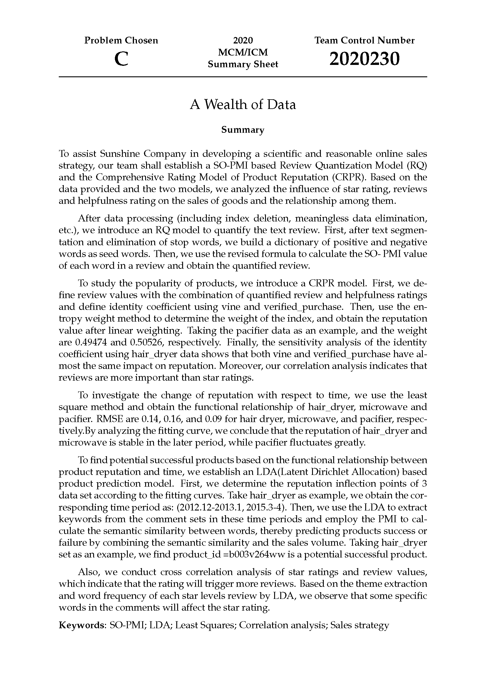

 2020MCM美赛数学建模-C题

<bold>Presented By R.G.</bold>

由于原本论文是用LaTeX编写并编译成pdf格式的，这里的README就只摘录一下摘要和目录部分了。详细论文思路相信阅读完summary应该大致也有了，目录主要展示一下论文的框架与布局。论文全文见仓库中的pdf文件，转载或引用望告知，谢谢！

## 摘要截图

## 目录截图

**注：如果你的github(中国国内)无法看到图片的话，请参考我的这篇文章**

[解决Github无法显示图片以及README无法显示图片](https://blog.csdn.net/qq_41709370/article/details/106282229)

## 论文全文

全文见仓库的 [2020230.pdf](./2020230.pdf)

