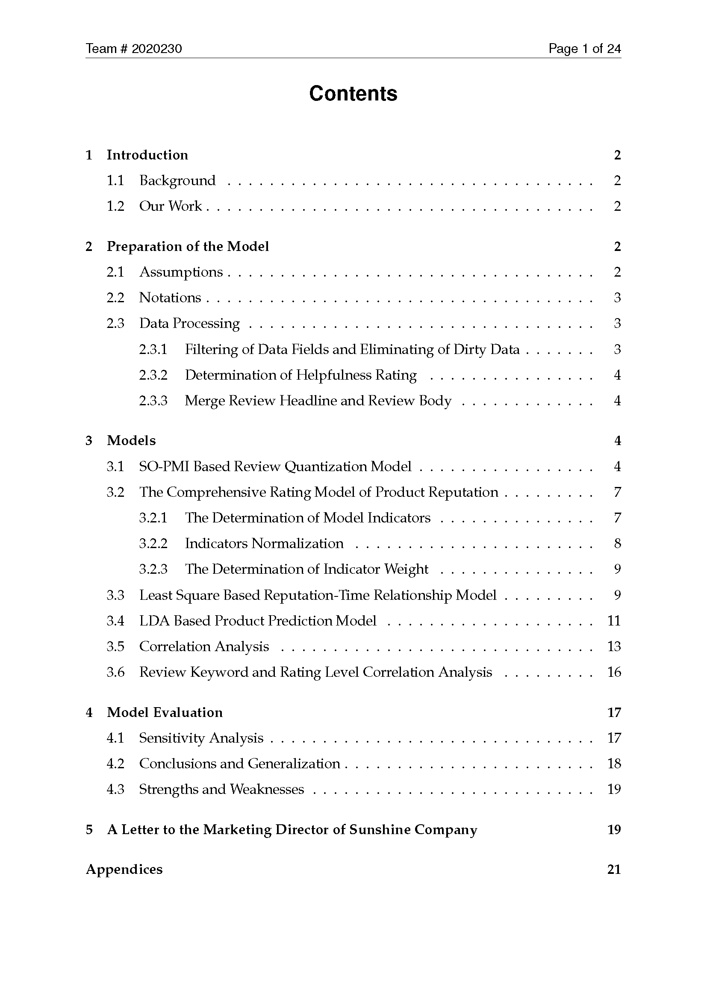

<p align="center"><font face="宋体" size=6> 2020MCM美赛数学建模-C题</font></p>

<p align="center"><font size=5><bold>Presented By R.G.</bold></font></p>

由于原本论文是用LaTeX编写并编译成pdf格式的，这里的README就只摘录一下摘要和目录部分了。详细论文思路相信阅读完summary应该大致也有了，目录主要展示一下论文的框架与布局。论文全文见仓库中的pdf文件，转载或引用望告知，谢谢！

## 摘要截图


## 目录截图

**注：如果你的github(中国国内)无法看到图片的话，请参考我的这篇文章**

[解决Github无法显示图片以及README无法显示图片](https://blog.csdn.net/qq_41709370/article/details/106282229)




## 全文

全文见仓库的 [2020230.pdf](./2020230.pdf)

### 注：

今天发现github的README不能居中显示文字，经过一番尝试找到如下方法可以使得文字居中：

```html
<p align="center"><font face="宋体" size=6> 2020MCM美赛数学建模-C题</font></p>
```

之前一直用下面的语句居中，但是在github的README中无效：

```html
<center><font face="宋体" size=6> 2020MCM美赛数学建模-C题</font></center>
```

此外，README中按文件夹（仓库）路径添加图片不能显示图片：

```markdown
[imgname](./img_path.png)
```

查阅[资料](https://www.cnblogs.com/aretstchen/p/6550143.html)，发现github中README.md关联图片的图片地址是具有规范格式：

```html
https://github.com/用户名/repository仓库名/raw/分支名master/图片文件夹名称/***.png or***.jpg
```

但是依旧不能正常显示图片，然后我研究了一下，找到了解决方案并写了博客：

[解决Github无法显示图片以及README无法显示图片](https://blog.csdn.net/qq_41709370/article/details/106282229)

